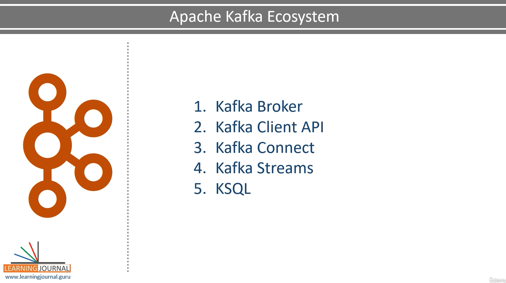
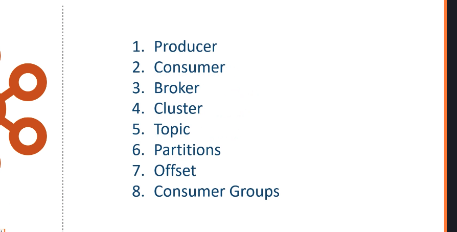
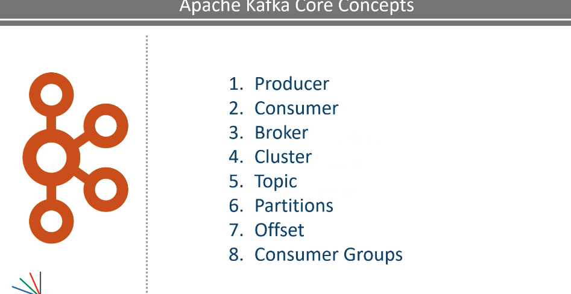

https://gale.udemy.com/course/apache-kafka-for-beginners/learn/lecture/17425986#overview

Producer is an application that sends data. - Message or message Record
It is a smal to medium sized piece of data

message record may have a different meaning and scheme or record structure

But for Kafka, it is a simple array of bytes

For example, if I want to send a data file to Kafka, I'll create a producer application, and send each

line of the file as a message.

In this case, a message is one line of text,

but for Kafka it is just an array of bytes.

Similarly, if I want to send all the records from a database table, I'll post to each row as a message.

Similarly if you want to send the result of a database query, you are going to create a producer application.
The producer is going to fire a query against your database, collect the result and start sending each

row as a message.
The producer is going to fire a query against your database, collect the result and start sending each

row as a message.

