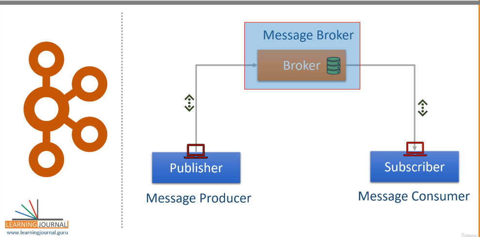

# kafka-dev
https://xebiaitarchitectsindia.udemy.com/course/apache-kafka-for-beginners

What is Apache Kafka
# Analysis of Apache Kafka Introduction

This appears to be an introductory section from Apache Kafka's documentation or website. Here's a breakdown of the key information:

## Core Concepts of Kafka
- Kafka is a **distributed streaming platform** with three main capabilities:
  1. Pub/sub functionality like a message queue
  2. Fault-tolerant storage of record streams
  3. Real-time stream processing

## Primary Use Cases
Kafka is used for:
1. Building real-time data pipelines between systems
2. Creating applications that process or react to data streams

## Learning on Kafka
1. Creating one or more real-time data streams
2. Processing real-time data Streams - Process these streams 

Example
Electricity Meeter - Kafka

Pub-Sub Messaging System

Publisher -> Broker-> Subscriber

 Publisher - Message Broker with Storage -> Consumer

Created by Linkedin in 2010

