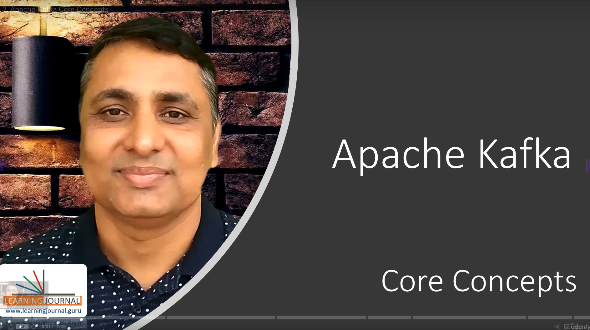
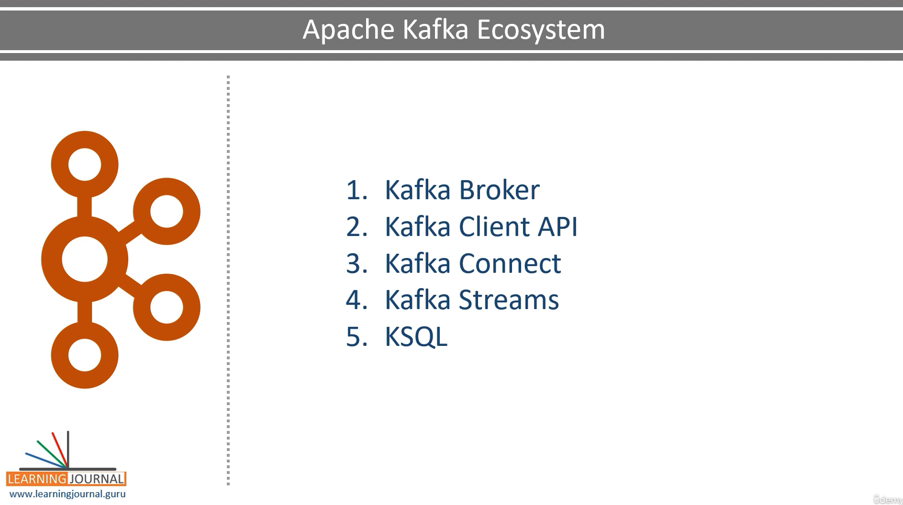
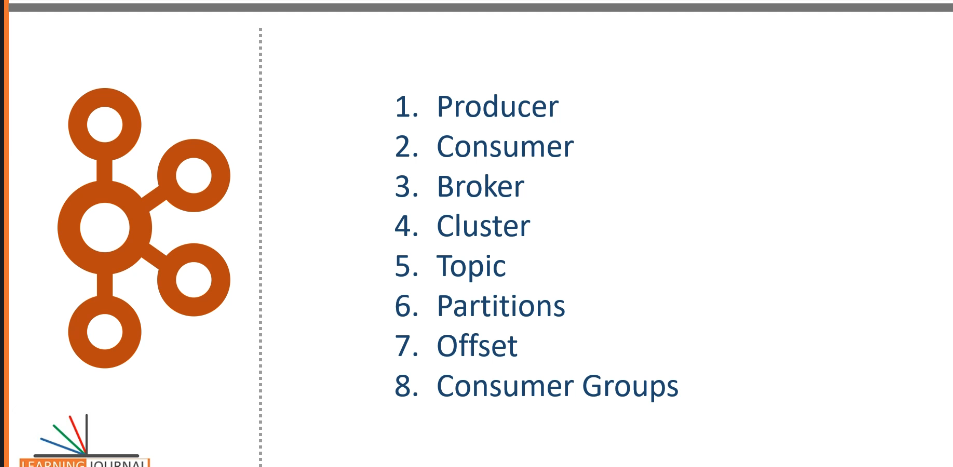
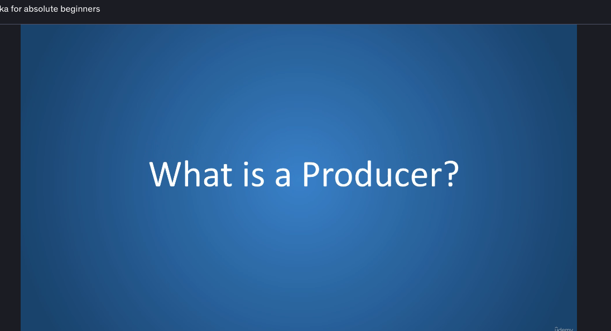
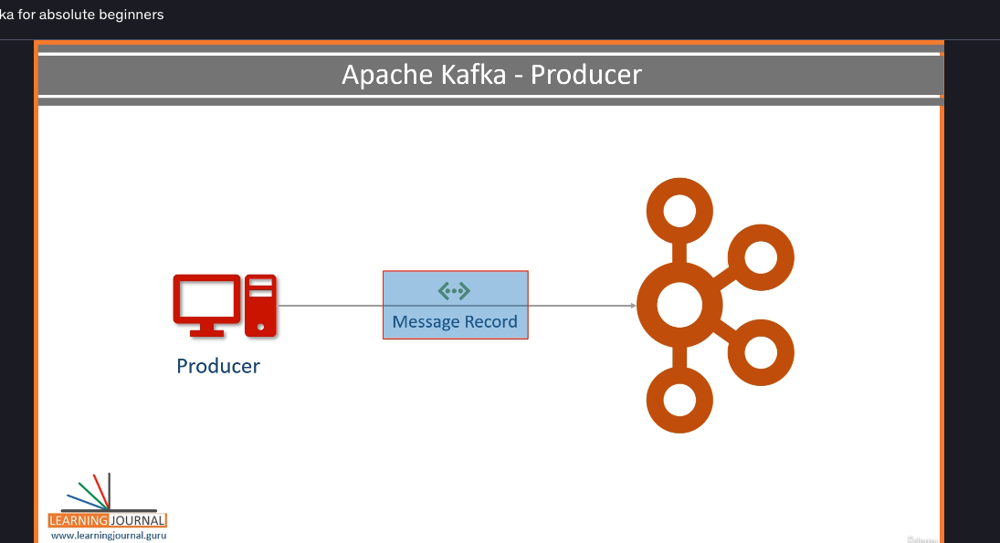
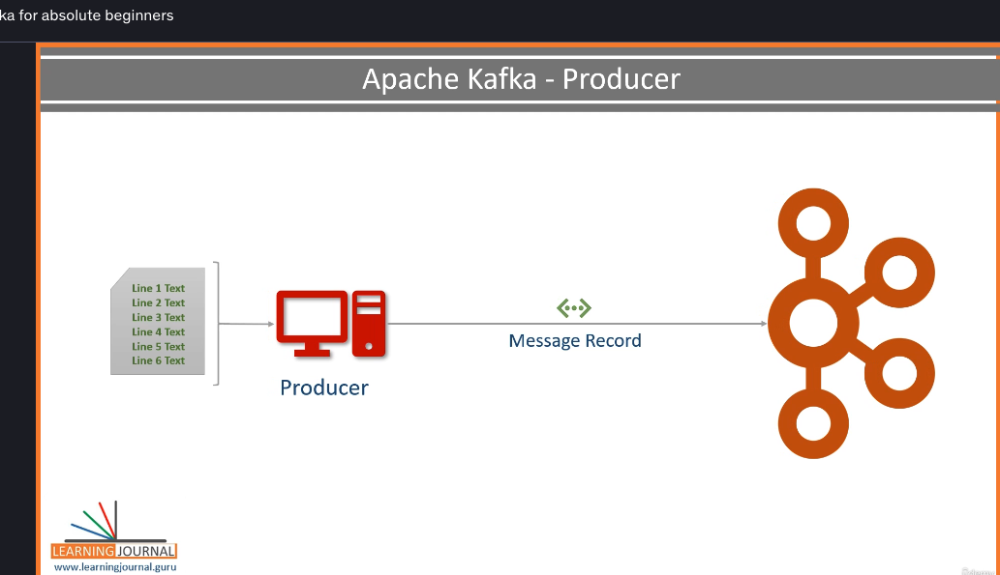
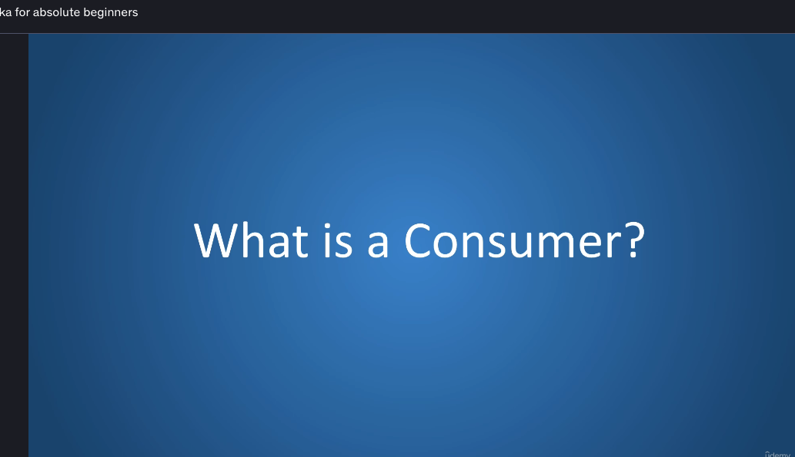

# Kafka EcoSystem Core Concepts

- 5 Kafka Core Components of echo Systems
    - Kafka Broker
    - Kafka Client API
    - Kafka Connect
    - Kafka Streams
    - KSQL

## Producer

So what is a producer? A producer is an application that sends data. or Message Record

The message record may have a different meaning and schema or record structure for us. But for

Kafka, it is a simple array of bytes.

###Example: Sending File

    For example, if I want to send a data file to Kafka, I'll create a producer application, and send each line of the file as a message. In this case, a message is one line of text, but for Kafka it is just an array of bytes.

###Example: Database Query
Similarly, if I want to send all the records from a database table, I'll post to each row as a message.

Similarly if you want to send the result of a database query, you are going to create a producer application.

The producer is going to fire a query against your database, collect the result and start sending each

row as a message.

So while working with Kafka if you want to send some data, you may have to create a producer application.
You might find an out of the box ready to use producer which fits your purpose.

## Consumer

The consumer is an application that receives data.

    If the producers are sending data they must be sending it to someone. Right? The consumers are the recipients. But remember, the producers are not going to send data directly to the recipients.
    They just send it to the Kafka server. And anyone interested in that data should come forward and consume the data from the server. So an application that is going to request data from the Kafka server is up consumer. And they can ask for the data sent by any producer provided that they have permissions to read it.

    So if we come back to the data file example, when I want to read the data file sent by a producer, I'll create a consumer application. Then I'll request the Kafka server for the data. The Kafka server will send me some messages. I guess you remember that each message record is a line of text from the data file. So, the consumer application. I guess you remember that each message record is a line of text from the data file. So, the consumer application. It will process them and again request for some more messages.
    This goes in a loop. The consumer keeps asking for the messages, the server keeps giving new records,

and this goes in a circle

as long as new messages are arriving at the kafka server. Now it's up to the consumer application on

using the data. They might want to compute some aggregates and send some alerts.
That part is up to the consumer application.

The next item in our list is the broker.
## Broker
What is a broker?
The broker is the Kafka server.

It is just a meaningful name that was given to the Kafka server, and this name makes sense as well.

Why? Because all that the server is doing is to act as a message broker between producer and consumer.
I mean the producer and consumers do not interact directly.
They use the Kafka server as an agent or a broker to exchange messages.

## Cluster
If you have any background in distributed systems, you already know that a cluster is a group of computers acting together for a common purpose.'

Kafka is a distributed system, and hence the cluster means the same thing for Kafka.
So the Kafka cluster is a group of computers, each running one instance of the Kafka broker.

## Topic
What is a Topic?

We already learned that the producer will be sending data to the broker. On the other side,

the consumer will be asking data from the broker. But the question is, what data or which data? The broker

might say, Guys, I am collecting data from multiple producers.

Which one do you want?
Give me the data sent by the smart meter producer.
Well the smart meter producer is sending three different types of data.

- current-load 
  - sent every minute. 
- consumed-units
  - This one is sent every hour
- input-current-fluctuations
  - This one is sent as and when it happens

  so out of above message which one do consumer want

  Say Current Load Message
  That's great. But we have a bunch of smart meter producers, and all of them are sending the current load messages.
  We must have some standard methods to cut down these back and forth questioning, right?
  And that's where we have the notion of Topic.

  So the topic is an arbitrary name given to a data set.
  You better say - it's a unique name for a data stream.

If you're coming from a database background, you can also think of it as a database table. Creating a  topic is a design time decision.
So when you are designing your application, you as an architect are responsible for creating one or more topics.

Once your topic is there, the producers and the consumers are going to send and receive data by the topic.

Now let's come back to our smart meter example.
Let's assume 

- Smart Meter-I created three topics. 
    - Current-Load-Topic, 
    - Consumed-Units-Topic, 
    - Input-Fluctuations

